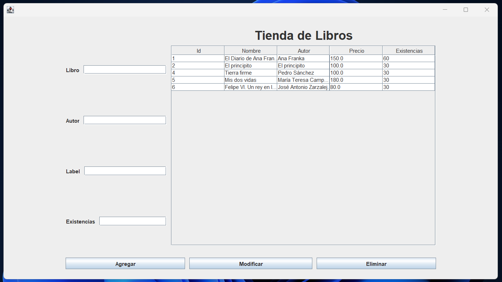

# 13 Días de Aprendizaje con Java

¡Bienvenido a mi viaje de 13 días explorando Java! 
A continuación, encontrarás un resumen diario de mis proyectos, enfocándome en el desarrollo de programas de consola.

## Día 1: 2024-01-01
### Proyecto: Calculadora
Inicié mi travesía construyendo una simple calculadora en Java. 
Este proyecto de consola permite familiar con la estructura básica de un programa Java y las operaciones fundamentales.

## Día 2: 2024-01-02
### Proyecto: Venta de Computadoras
Hoy me cree de un programa de consola para gestionar ventas de computadoras. 
Exploré conceptos como entrada de usuario, almacenamiento de datos y operaciones lógicas.

## Día 3: 2024-01-03
### Proyecto: Lista de Personas
Hoy realizamos un programa de consola para gestionar listas de personas. 
Se trabaja con arreglos, bucles y funciones, mejorando las habilidades en la manipulación de datos en Java.

## Día 4: 2024-01-04
### Proyecto: Catalogo de Películas
Hoy creamos un programa de consola para gestionar un catálogo de películas.
Se trabaja con clases, objetos y métodos, mejorando las habilidades en la manipulación de datos en Java.
Y rl catalogo de las peliculas se guarda en un archivo txt para poder tener persistencia de datos dentro d eese txt.

## Día 5: 2024-01-05
### Proyecto: CRUD de Estudiantes con Base de Datos MySQL
Hoy creamos un programa de consola para gestionar un CRUD de estudiantes.
Se trabaja con clases, objetos y métodos, mejorando las habilidades en la manipulación de datos en Java.
Y el CRUD de los estudiantes se guarda en una base de datos MySQL para poder tener persistencia de datos dentro de la base de datos.
Nota Importante: el archivo de la base de datos se encuentra en la carpeta de la raiz del proyecto con el nombre de "estudiantes.sql"

## Día 6: 2024-01-06
### Proyecto: CRUD de Estudiantes con Base de Datos MySQL y Spring Boot
Hoy creamos un programa de consola para gestionar un CRUD de estudiantes.
Se trabaja con clases, objetos y métodos, mejorando las habilidades en la manipulación de datos en Java.
Y el CRUD de los estudiantes se guarda en una base de datos MySQL para poder tener persistencia de datos dentro de la base de datos.
Para este proyecto se utilizo Spring Boot para poder tener una mejor estructura del proyecto y poder tener una mejor organizacion de los archivos.

## Día 7: 2024-01-07
### Proyecto: CRUD Tienda de libros con base de datos MySQL y JavaFX
Hoy creamos un crud de tienda de libros con base de datos MySQL y JavaFX para poder tener una interfaz grafica.
Se trabaja con clases, objetos y métodos, mejorando las habilidades en la manipulación de datos en Java.
Y el CRUD de los libros se guarda en una base de datos MySQL para poder tener persistencia de datos dentro de la base de datos.

## Día 8: 2024-01-09
### Proyecto: CRUD Sistema de Tareas con base de datos MySQL, JavaFX y Spring Boot 
Hoy creamos un crud de sistema de tareas con base de datos MySQL y JavaFX para poder tener una interfaz grafica.
Se trabajio con clases, objetos y métodos, mejorando las habilidades en la manipulación de datos en Java.
Y el CRUD de las tareas se guarda en una base de datos MySQL para poder tener persistencia de datos dentro de la base de datos.
La interfaz grafica se realizo con JavaFX y se utilizo Spring Boot para poder tener una mejor estructura del proyecto y poder tener una mejor organizacion de los archivos.
la interfax grafica esta creada en la carpeta de resources con el nombre de "FXML" y el archivo principal es "index.fxml"

¡Sigue mi viaje diario mientras profundizo en los conceptos de Java y desarrollo habilidades más avanzadas! 
Tu feedback es siempre bienvenido. 

## ¡Gracias por unirte a mí en este viaje de aprendizaje!
